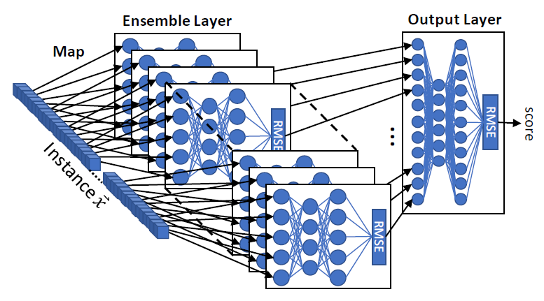

# Kitsune Network PyTorch 🦊

This repository contains a Kitsune algorithm implementation with PyTorch.

This implementation is faster (order of x10 faster in time) and much more efficient 
than the [official implementation](https://github.com/ymirsky/KitNET-py) done in plain numpy.

This deep learning model is described in depth in the [Kitsune: An Ensemble of Autoencoders for Online Network Intrusion Detection
](https://arxiv.org/pdf/1802.09089v2.pdf) paper.



## What is Kitsune?

Authors citation:

> KitNET is an online, unsupervised, and efficient anomaly detector. A Kitsune, 
in Japanese folklore, is a mythical fox-like creature that has a number of tails, 
can mimic different forms, and whose strength increases with experience. Similarly, 
Kit-NET has an ensemble of small neural networks (autoencoders), which are trained 
to mimic (reconstruct) network traffic patterns, and whose performance incrementally 
improves overtime.

## How to train a model

The easiest way to train a model is using the provided CLI.

```
$ python -m kitsune train --help
Usage: __main__.py train [OPTIONS] INPUT_PATH

Arguments:
  INPUT_PATH  [required]

Options:
  --batch-size INTEGER          [default: 32]
  --file-format [csv|parquet]   [default: csv]
  --compression-rate FLOAT      [default: 0.6]
  --checkpoint-dir PATH         [default: models]
  --is-scaled / --no-is-scaled  [default: False]
  --help                        Show this message and exit.
```

The supported `INPUT_PATH` data format is a directory containing either CSVs or 
parquet files (choose the format in the `--file-format` option).

> ⚠ Datasets must be normalized between 0 - 1.

### Customize your training

In case you have to build a custom data pipeline and train the model manually
take a look at the example below:

```python
import torch
import kitsune
import operator
import torchdata.datapipes.iter as it

dp = it.IoPathFileLister("s3://bucket/dataset").filter(lambda p: p.endswith(".json"))
dp = FileOpener(dp, mode="r").parse_json_files().map(operator.itemgetter(1))
dp = dp.map(lambda jp: torch.as_tensor(jp["features"]))
dp = dp.batch(32).collate(torch.stack)

fm = kitsune.engine.build_feature_mapper(dp, ...)  # Fill with your parameters
model = kitsune.Kitsune(feature_mapper=fm)
optimizer = torch.optim.SGD(model.parameters(), lr=1e-3)
for epoch in range(10):
    kitsune.engine.train_single_epoch(model, dp, optimizer, epoch=epoch)

model.save("kitsune.pt")  # Keep it for later
```

In this example, we take a set of json files from s3 and convert the value within
the `features` attribute and convert them to a `torch.Tensor`. Then, we batch
the the examples and train the Kitsune net with the builtin `kitsune.engine`
utilities.

## Using a pretrained model

To instantiate the model with the `from_pretrained` class method you previously
have to serialize the model with the `save` instance method (as we do in the 
above example).

```python
import kitsune

model = kitsune.Kitsune.from_pretrained("kitsune.pt")

# Get the anomaly score of a batch of samples
samples = torch.randn(16, 128)
with torch.inference_mode():
    scores = model(samples)

# scores of shape (16,)
```
